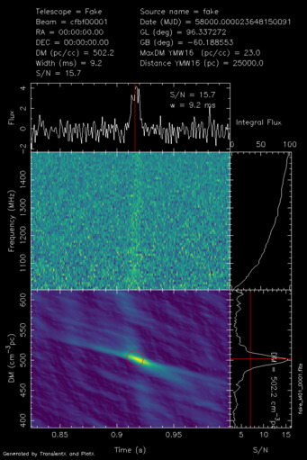

# TransientX

TransientX is a one command line high performance transient search software.

## Dependencies

- boost > 1.56
- PlotX (https://github.com/ypmen/PlotX)
- sofa

## Installation
- ./bootstrap
- ./configure --prefix=[install_path] LDFLAGS="-L/path_to_sofa" CPPFLAGS="-I/path_to_sofa"
- make
- make install

## Usage
- export YMW16_DIR=/install_path/src/ymw16
- transientx -h for help

## Example

