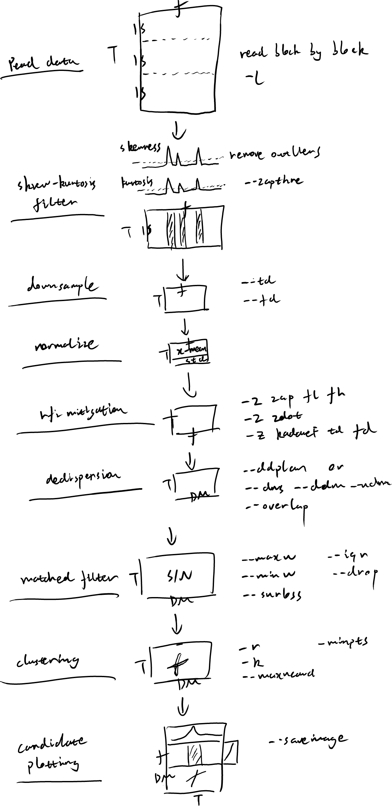
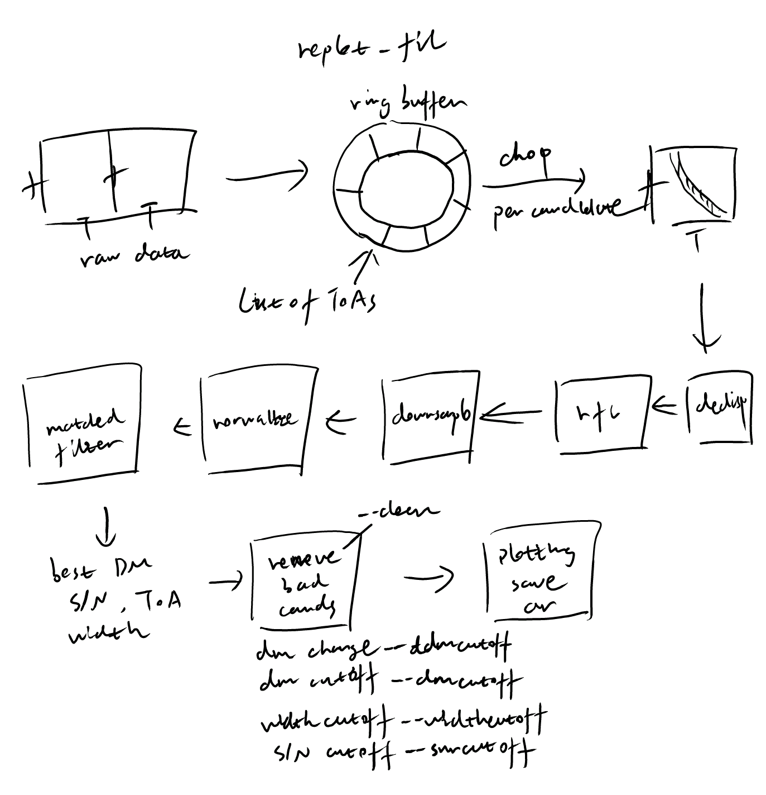

================
Pipeline
================

transientx_fil
--------------------

TransientX includes a full processing pipeline for transient detection, as shown in the diagram below.
The pipeline reads data from SIGPROC filterbank files or PSRFITS files (using options such as ``--wts``, ``--scloffs``, ``--zero_off``, and ``--psrfits``) in data chunks. The length of each chunk can be configured using the ``-l`` option.
The pipeline produces candidate plots in PNG format and generates a candidate list.

replot_fil
--------------------

The replot_fil tool reprocesses the candidates generated by transientx_fil, removing duplicate and bad candidates based on multiple criteria, and can generate archive files for further analysis.

.. toctree::
   :maxdepth: 2
   :caption: Contents:

   pipeline/preprocess
   pipeline/rfi_mitigation
   pipeline/dedispersion
   pipeline/matched_filtering
   pipeline/clustering
   pipeline/candidate_plotting