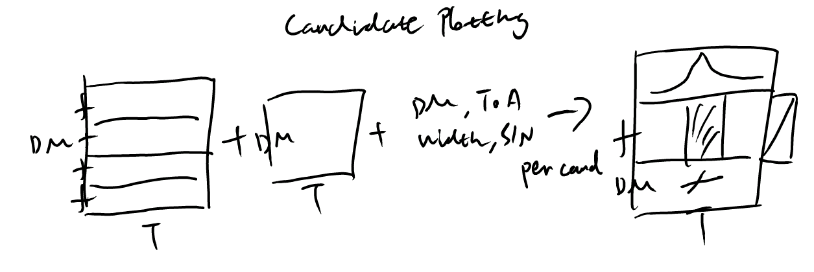

=====================
Candidate plotting
=====================

The candidate plotting step is responsible for generating visual representations of the detected candidates from the transient search pipeline. This module takes the output parameters from the clustering stage and creates detailed plots using the products generated in the dedispersion step, which aid in the evaluation and classification of potential transient events. The option ``--saveimage`` enables saving the plots in FITS format for further AI-based classification.

