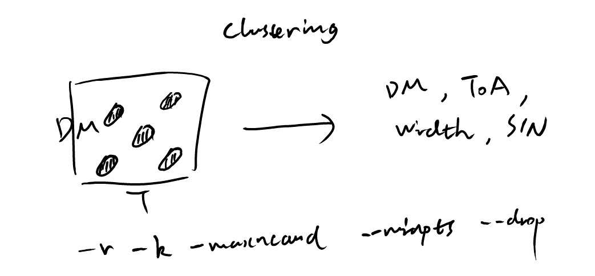

================
Clustering
================

The clustering step applies the DBSCAN algorithm (see `Men and Barr (2024) <https://ui.adsabs.harvard.edu/abs/2024A%26A...683A.183M/abstract>`_) to group detected single pulse events into candidates based on their proximity in time and DM space. This helps reduce duplicate detections.
The options ``-r`` and ``-k`` set the parameters ``eps`` and ``min_samples`` of the DBSCAN algorithm, which control clustering sensitivity. A larger ``eps`` value allows more distant points to be considered part of the same cluster, while a larger ``min_samples`` value requires more points to form a cluster.
The option ``--maxncand`` limits the maximum number of candidates generated after clustering one data chunk. If the number of candidates exceeds this limit, only the top candidates with the highest S/N are kept for further processing.
The option ``--drop`` drops candidates whose boxcar width equals the maximum boxcar width used in matched filtering. These candidates are likely RFI, and dropping them helps reduce false positives.

