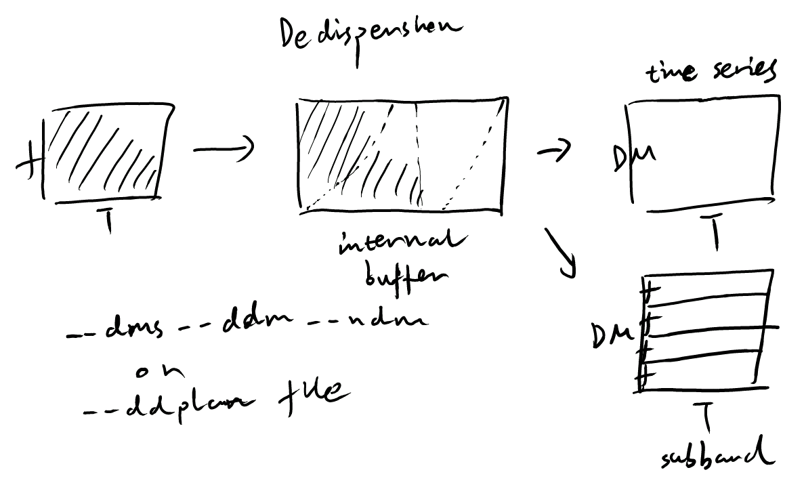

================
Dedispersion
================

The radio signals from astrophysical sources are dispersed by the interstellar medium (ISM), which can reduce the signal-to-noise ratio (S/N) of the transient signals without dedispersion. The dedispersion process applies the `subband dedispersion algorithm <https://ui.adsabs.harvard.edu/abs/2011MNRAS.417.2642M/abstract>`_ to the preprocessed data, generating dedispersed time series for a range of trial DMs. The dispersion range can be set up with the options ``--dms``, ``--ddm``, and ``--ndm`` or ``--ddplan ddplan_file``. The format of the ddplan file looks like:

.. code-block:: text

	# td fd dms ddm ndm snrloss maxwidth(s)
	1 1 0.0 0.1 3344 0.1 0.1
	2 1 334.4 0.2 1255 0.1 0.1
	4 1 585.2 0.3 1334 0.1 0.1
	8 1 985.4 0.5 1674 0.1 0.1
	16 1 1821.9 1.0 1179 0.1 0.1

