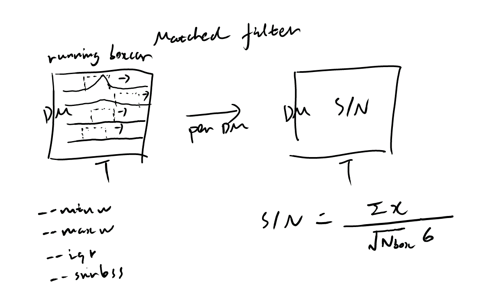

====================
Matched filtering
====================

The matched filtering step calculates the S/N of signals in boxcar windows of varying widths. This generates a spectrum of S/N as a function of DM and time.
The options ``--maxw`` and ``--minw`` set the maximum and minimum boxcar widths (in seconds) to be searched.
The option ``--snrloss`` controls the S/N loss tolerance when generating boxcar width steps.

