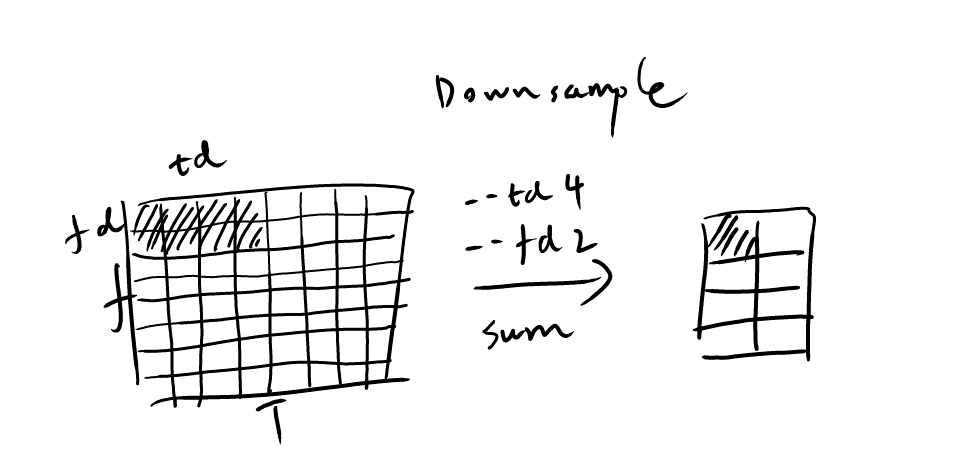
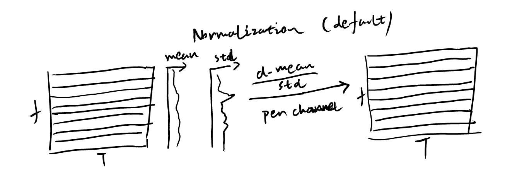
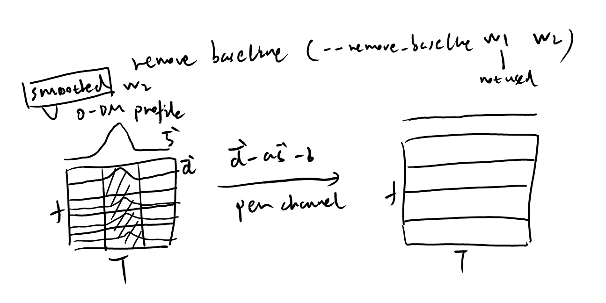

================
Preprocess
================

Downsample
------------

The downsampling process reduces the number of time samples and frequency channels by summarizing neighboring values. This decreases data size and speeds up subsequent processing steps. The options ``--td`` and ``--fd`` specify the downsampling factors in the time and frequency dimensions, respectively.

Normalization
--------------

The normalization process rescales the data in each frequency channel to have zero mean and unit variance. This step helps mitigate the effects of varying noise levels across different channels, improving transient detection performance. This step is applied by default.

Remove baseline
-----------------

The baseline removal process eliminates low-frequency trends in the data by subtracting a smoothed profile of the zero-DM time series. This enhancement helps reveal transient signals that may be obscured by slow variations in the baseline level. The option ``--baseline arg1 arg2`` sets up the size of the smoothing window, where arg1 is deprecated.

