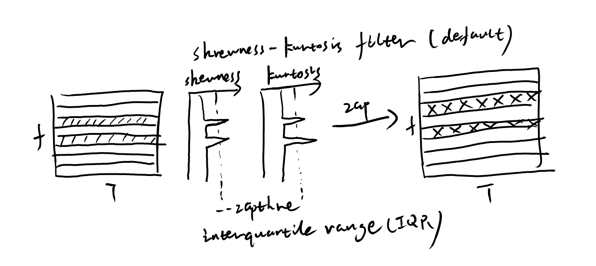
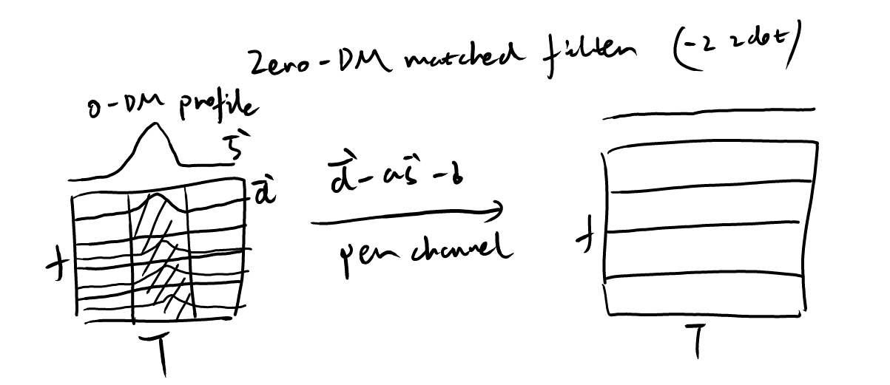
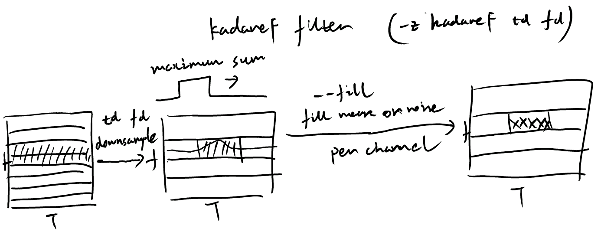
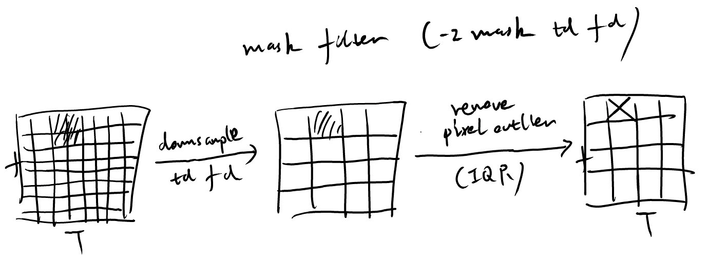

================
RFI mitigation
================

Manually zap
----------------

The option ``--zap flow fhigh`` allows users to manually specify frequency ranges (MHz) to be zapped (set to mean). Multiple ranges can be specified by repeating the option like: ``-z zap flow1 fhigh1 zap flow2 fhigh2``.

Skewness-Kurtosis filter
-------------------------

The Skewness-Kurtosis filter is implemented based on the method described in `Men et al. (2023) <https://ui.adsabs.harvard.edu/abs/2023A%26A...679A..20M/abstract>`_. This method calculates the skewness and kurtosis of time series data in each frequency channel to identify and mitigate RFI. Outliers in skewness and kurtosis are removed, and the interquartile range (IQR) threshold can be set with the option ``--zapthre``. A negative threshold value disables this step.

Zero-DM matched filter
-----------------------

The Zero-DM matched filter is based on the method described in `Men et al. (2019) <https://ui.adsabs.harvard.edu/abs/2019MNRAS.488.3957M/abstract>`_. This filter subtracts the correlation component between the data in each channel and the zero-DM profile. The option ``-z zdot`` enables this filter in the pipeline.

KadaneF filter
----------------

The KadaneF filter removes slow-varying RFI in time across frequency channels by searching for the window with maximum summation along the time axis.
The option ``-z kadaneF td fd`` enables this filter in the pipeline, where ``td`` and ``fd`` are predownsampling factors in time and frequency respectively. These factors do not affect other processing steps.

Mask filter
----------------

The mask filter removes outliers in the time-frequency data based on an IQR threshold.
The option ``-z mask td fd`` enables this filter in the pipeline, where ``td`` and ``fd`` are predownsampling factors in time and frequency respectively. These factors do not affect other processing steps.

